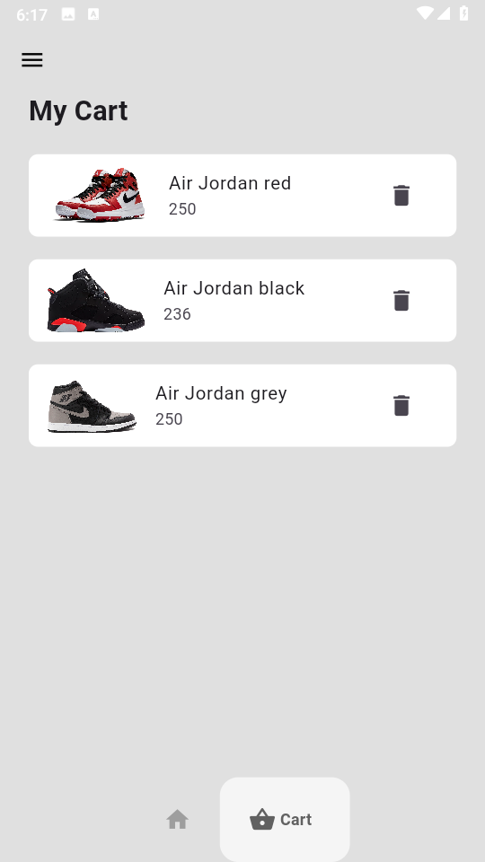

# E-commerce Demo

his is a Flutter project that demonstrates an e-commerce application with a shopping cart functionality.

 

## Features

- Browse and view product details

  

- Add products to the shopping cart

    

- Remove products from the shopping cart

## Getting Started

To run this project locally, follow these steps:

1. Make sure you have Flutter installed on your machine. You can find the installation instructions [here](https://flutter.dev/docs/get-started/install).

2. Clone this repository:

   - git clone https://github.com/Chinokoo/ecommerce_demo.git

3. Navigate to the project directory:

   - cd ecommerce_demo

4. Install the required dependencies:

   - flutter pub get

5. Run the app on your preferred device or emulator:

   - flutter run

## Dependencies

This project uses the following dependencies:

- [provider](https://pub.dev/packages/provider) - A state management solution for Flutter

## Contributing

Contributions are welcome! If you find any issues or have suggestions for improvements, please open an issue or submit a pull request.

## License

This project is licensed under the [MIT License](LICENSE).

This README file provides an overview of the project, instructions for getting started, a list of dependencies, and information about contributing and licensing. You can customize it further based on your project's specific requirements.
